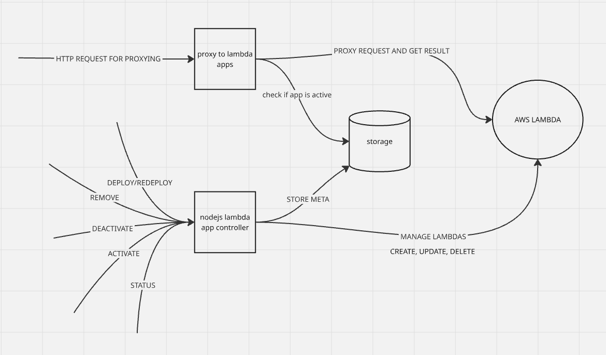

# app-orchestrator

Orchestrator of small applications for AWS Lambda.



## Features
- Manage lambdas with a simple REST API. 
- Proxy requests to lambdas. Proxy deconstructs request and sends it to the lambda as a key-value map. So each lambda must have an interface that accepts and is able to parse such a map.

## Roadmap
- Add distributed storage
- Add s3 integration
- Mini-app version management
- Add support of PackageType: Image
- Now proxy and manager are the same service, need to split them for better scalability
- Add better error handling
- Add more tests
- Tighter AWS lambda API integration, monitoring and synchronization with AWS lambda state
- Need more strict contract for lambda applications for better proxying
- Domain names for each application
- Increased availability: multiple replicas of the manager and proxy
- Mini-apps need observability: structured logs, metrics and tracing, health/readiness probes, dashboards and alerts
- Async-style execution for long-working AWS API calls

Notes:
- There is need to provide AWS credentials to the orchestrator.
- Openapi spec is provided at `/openapi.json`

## Run with Docker

Build container:
```bash
docker build -t orchestrator -f .\Dockerfile .
```

Run container:
```bash
docker run --rm -p 8080:8080 \
  -e AWS_ACCESS_KEY_ID= \
  -e AWS_SECRET_ACCESS_KEY= \
  -e AWS_REGION=eu-north-1 \
  -e AWS_LAMBDA_ROLE_ARN=arn:aws:iam::<account-id>:role/<role-name> \
  orchestrator
```

Example AWS lambda
```js
            exports.handler = async (event) => {
              const path = (event && (event.rawPath || event.path)) || '/';
              const method = ((event && (event.requestContext && event.requestContext.http && event.requestContext.http.method)) || event.httpMethod || 'GET').toUpperCase();

              const ok = (body) => ({ statusCode: 200, headers: { 'Content-Type': 'text/plain' }, body: String(body ?? '') });
              const badRequest = (body) => ({ statusCode: 400, headers: { 'Content-Type': 'text/plain' }, body: String(body ?? '') });
              const notFound = () => ({ statusCode: 404, headers: { 'Content-Type': 'text/plain' }, body: 'Not Found' });
              const getQuery = (name) => {
                const qp = event && (event.queryStringParameters || event.multiValueQueryStringParameters);
                if (!qp) return undefined;
                return (qp[name] && (Array.isArray(qp[name]) ? qp[name][0] : qp[name])) || undefined;
              };
              const getJsonBody = () => {
                if (!event || event.body == null) return {};
                try {
                  return typeof event.body === 'string' ? JSON.parse(event.body) : event.body;
                } catch (e) {
                  return {};
                }
              };
              
              if (path === '/' && method === 'GET') {
                return ok('success');
              }
              
              if (path === '/notFound' && method === 'GET') {
                return badRequest('bad request text');
              }
              
              if (path === '/testProxyingWithQueryParams' && method === 'GET') {
                const text = getQuery('text') || '';
                return ok(`${text}`);
              }
              
              if (path === '/testProxyingWithBody' && method === 'POST') {
                const body = getJsonBody();
                const text = (body && body.text) || '';
                return ok(`${text}`);
              }
              
              return notFound();
            };
```